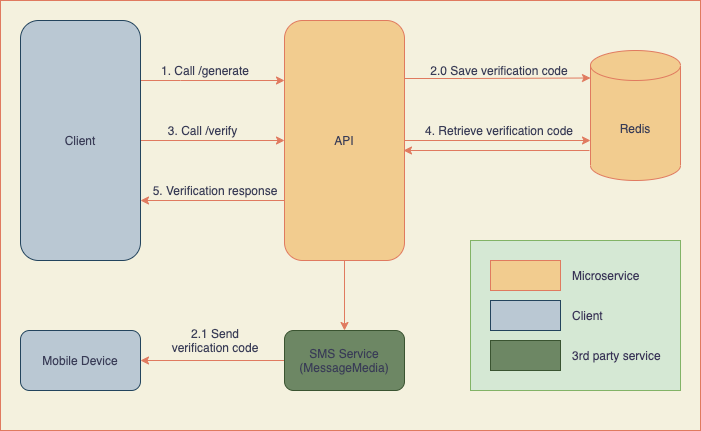

# Verification Code Service

This is a microservice to generate and verify a 6 digit verification code. It can be applied in the common verification use case.

Basic use cases

  - The verification code is generated as per mobile number and will expire in 2 minutes.
  - The verification code generation is limited to 3 times a day per mobile number. After exceeding the limit, users have to retry in the next day.

## Getting Started

### Build and Run

Run `docker-compose up --build`

### Sample Requests

- Endpoint: `/ping`

  Request: `curl -X GET 'localhost:8080/ping'`

  Response: `pong`

- Endpoint: `/generate`

  Request: `curl -X POST 'localhost:8080/generate' -H 'Content-Type: application/json' -d '{"phone_number": "0487654321"}'`

  Response: `true`

- Endpoint: `/verify`

  Request: `curl -X POST 'localhost:8080/verify' -H 'Content-Type: application/json' -d '{"phone_number": "0487654321","verification_code": "572631"}'`

  Response: `true`

### Get Verification Code

> The verification code generated via `/generate` is stored in Redis. A text message will be sent to the designated mobile. You can also get it via the commands below.

1. Run `docker run -it --rm --network go-verification-code_app-tier bitnami/redis:latest redis-cli -h redis` to connect to the `redis` container.
2. Get the verfication code by key, e.g: `get code:+61487654321`.
3. Then you can use the verfication code in the `/verify` request.

### SMS Service

MessageMedia

- [MessageMedia](https://messagemedia.com/au/) is used as an SMS service to send the verification code via text messages.
- You can replace the SMS_AUTHORIZATION value in the config.env file with your own MessageMedia API key/secret pair to make it work.
- In testing, the Australian (+61) mobile number is used.
- Refer to https://messagemedia.github.io/documentation/ for more information.

Alternatively, you can adopt other SMS service by implementing the `SmsClientInterface` interface.